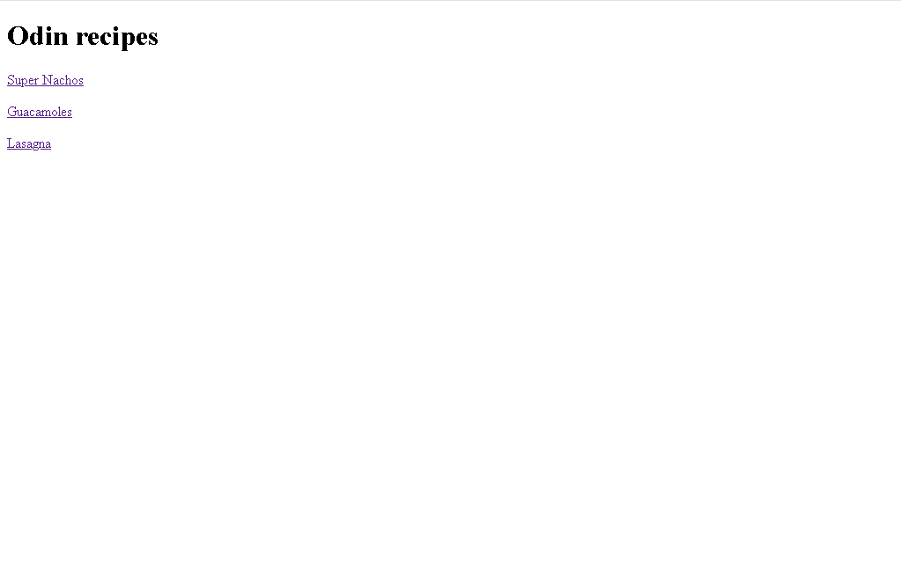

# Project Name

> Odin recipes.

esto es un projecto sobre como hacer reseta en html 

## Built With

- Vs code
- Git bash

## Live Demo

[Live Demo Link](https://rafaelb056.github.io/odin_recipes)

## Getting Started

**This is an example of how you may give instructions on setting up your project locally.**
**Modify this file to match your project, remove sections that don't apply. For example: delete the testing section if the currect project doesn't require testing.**

To get a local copy up and running follow these simple example steps.

### Prerequisites

### Setup

### Install

### Usage

### Run tests

### Deployment

## Authors

👤 **Rafael Benitez Enriquez Gonzales**

- GitHub: [@rafaelb056](https://github.com/rafaelb056)

## 🤝 Contributing

Contributions, issues, and feature requests are welcome!

Feel free to check the [issues page](https://github.com/rafaelb056/odin_recipes/issues).

## Show your support

muchas gracias por el apoyo

## Acknowledgments

- gracias al profesor aristides

## 📝 License

This project is [CC0 1.0 Universal](LICENSE) licensed.